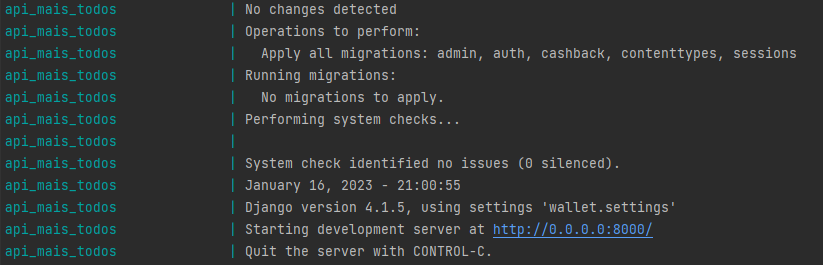
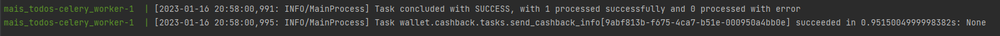

# Cashback in Django Rest Framework

## Considerations
For test purpose i did not create a new app to store the product, but i understand that's
better for scaloning. 

## Used stacks:
- Django Rest Framework (API)
- Docker (Containering the app and all the services and db) 
- Postgres (store data into database)
- Celery (Worker to handle the tasks)
- Celery beat (cronjob to send the task every x minutes)
- Redis (to cash the celery)

## Steps
- just run ```docker-compose up --build``` you shouldn't have problem this time!
Once the docker is running, you can test the API below


### I'm sending an export of requests from postman, file:
```Mais Todos.postman_collection.json```
just import to your postman and test API

I'm using basic auth for this assessment, also i added this inside settings.py
(is not recomended, but it's just a test, right?)
username = admin
password = mystrongpassword

feel free to create another user, using ```createsuperuser``` command inside docker


## Added Test Cases with APITestCase
just run inside docker:
```docker-compose run api bash```
then:
```python manage.py test```

## Celery and Celery beat
Now the call to the external api is made using celery.

## Code improved with the suggestions made by email

## Prints to ensure the app is ok
### Docker


###  Celery Beat
